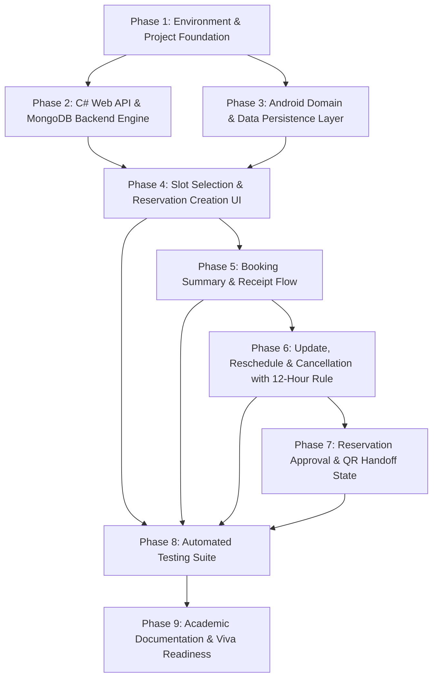

# Development Phases & Sub-Phases: Reservation Workflow (Member 3)

Based on the SE4040 Enterprise Application Development specification, project rules, and team boundaries, here is the comprehensive breakdown of all Phases and Sub-Phases required for developing the **Reservation Workflow & Energy Slot Booking** component.

---

## Component Overview & Target Context
- **Target Branch**: `feature/member-3-reservation-workflow`
- **Student Name**: Kumarasinghe S.S
- **Student ID**: IT22221414
- **Component**: Energy Slot Booking, Reservation Creation, Update, Cancellation, Approval, 7-Day & 12-Hour Rules
- **Module**: SE4040 Enterprise Application Development (2026)
- **Architecture**: FAT Service (C# ASP.NET Web API + MongoDB) + Clean MVVM Native Android (Kotlin + Room SQLite)

---

## Development Phases Roadmap

---

## Phase 1: Environment & Project Foundation
### Sub-phase 1.1: Android Dependency & Gradle Baseline
- Verify SDK 34, compile SDK 34, and JVM toolchain (Java 17).
- Ensure required libraries are integrated: ViewBinding, Material 3, Retrofit2 + OkHttp3, Room SQLite, Kotlin Coroutines, StateFlow, JUnit4 / MockWebServer / Robolectric.
### Sub-phase 1.2: Resource & Design System Tokens
- Define color tokens in `res/values/colors.xml` (`PendingApproval`: `#FFF8E1` / `#F57F17`, `Approved`: `#E3F2FD` / `#1565C0`, `Cancelled`: `#FFEBEE` / `#C62828`).
- Define dimension tokens in `res/values/dimens.xml` and all UI labels in `res/values/strings.xml` (zero hardcoded strings rule).
### Sub-phase 1.3: Package & Architecture Scaffolding
- Scaffold clean MVVM packages under `com.sliit.ssmts.reservation_workflow` (`data/local`, `data/remote`, `data/repository`, `domain/model`, `domain/repository`, `ui/booking`, `ui/summary`, `ui/manage`, `ui/common`, `util`).

---

## Phase 2: Central C# Web API & MongoDB Backend (FAT Service Invariant)
### Sub-phase 2.1: Data Models & DTOs
- Models: `EnergyReservation.cs`, `EnergyBookingSlot.cs`.
- DTOs: `CreateReservationDto.cs`, `UpdateReservationDto.cs`, `ReservationDetailDto.cs`, `AvailableSlotDto.cs`.
### Sub-phase 2.2: The 7-Day & 12-Hour Business Rule Engine
- Implement `IReservationService.cs` and `ReservationService.cs`:
  - **7-Day Rule**: Check if `ScheduledDateTime >= UtcNow` and `<= UtcNow.AddDays(7)`. Reject if > 7 days with `ERR_7_DAY_RULE_EXCEEDED`.
  - **12-Hour Rule**: For update or cancel requests, verify `(CurrentScheduledDateTime - UtcNow).TotalHours >= 12`. Reject if < 12 hours with `ERR_12_HOUR_RULE_VIOLATION`.
  - **Slot Concurrency Lock**: Check if requested station bay is already booked for that time window.
### Sub-phase 2.3: RESTful Endpoints in `ReservationsController.cs`
- `GET /api/reservations/slots`: Query available energy slots by station and date.
- `POST /api/reservations`: Create new booking (enforces 7-day rule and slot lock).
- `GET /api/reservations/{id}`: Retrieve detailed booking summary receipt.
- `PUT /api/reservations/{id}`: Reschedule slot / update energy (enforces 12-hour and 7-day rules).
- `DELETE /api/reservations/{id}`: Cancel reservation (enforces 12-hour rule, releases bay).
- `POST /api/reservations/{id}/approve`: Operator/Admin approval transition.

---

## Phase 3: Android Domain & Data Persistence Layer (Room SQLite)
### Sub-phase 3.1: Domain Models & Repository Contracts
- Define pure Kotlin models: `Reservation.kt`, `EnergySlot.kt`, `ReservationStatus.kt`.
- Define interface `IReservationRepository.kt` with clean abstractions.
### Sub-phase 3.2: Room SQLite Local Cache (`ssmts_local.db`)
- Entity: `ReservationEntity.kt` mapping table `tbl_reservations_cache`.
- DAO: `ReservationDao.kt` for upserting bookings, querying active/pending reservations, and offline fallback.
- Database: `SsmtsDatabase.kt` configuration.
### Sub-phase 3.3: Retrofit Remote Service & Security
- Define `ReservationApi.kt` with Retrofit endpoints.
- Implement `AuthHeaderInterceptor.kt` injecting `Authorization: Bearer <token>`.
- Implement `NetworkResult.kt` sealed class (`Success`, `Error`, `Exception`).
### Sub-phase 3.4: Repository Implementation
- Implement `ReservationRepositoryImpl.kt` orchestrating remote REST API calls with local Room SQLite caching.

---

## Phase 4: Energy Slot Selection & Reservation Creation UI
### Sub-phase 4.1: Slot Discovery & Date Picker (7-Day Boundary)
- Build `SlotSelectionActivity.kt` displaying stations, battery bays, and time slots.
- Date picker configured with defensive constraints: `minDate = Today`, `maxDate = Today + 7 Days`.
### Sub-phase 4.2: Reservation Form & Estimated kWh Input
- Build `CreateReservationActivity.kt` capturing Prosumer NIC, bay choice, slot, and estimated kWh (`0.1` to `500.0 kWh`).
- Integrate defensive input checks before submitting.
### Sub-phase 4.3: ReservationViewModel State Holder
- Implement `ReservationViewModel.kt` handling slot loading, 7-day validation, and reservation creation StateFlow (`Idle`, `Loading`, `Success`, `Error`).

---

## Phase 5: Booking Summary & Receipt Flow
### Sub-phase 5.1: Summary Receipt Screen
- Build `BookingSummaryActivity.kt` showing reservation ID, station name, bay, scheduled time, estimated energy, and status badge (`PendingApproval`).
### Sub-phase 5.2: State Management & Cache Update
- Build `BookingSummaryViewModel.kt` to load cached or live reservation details and refresh local SQLite cache.

---

## Phase 6: Reservation Update & Cancellation (The 12-Hour Rule)
### Sub-phase 6.1: Client-Side Rule Validation Utilities
- Implement `DateRuleValidator.kt` evaluating hours remaining (`hoursUntilAppointment < 12`).
### Sub-phase 6.2: Reschedule & Update Slot Dialog
- Build `UpdateReservationDialog.kt`: allows changing slot if >= 12 hours remaining; shows warning banner and disables button if < 12 hours.
### Sub-phase 6.3: Cancellation Confirmation Dialog
- Build `CancelReservationDialog.kt`: allows prosumer to cancel if >= 12 hours remaining; enforces confirmation prompt.
### Sub-phase 6.4: ManageReservationViewModel
- Coordinates update and cancellation calls, handles HTTP 400 error codes gracefully, and updates local Room cache.

---

## Phase 7: Reservation Approval & QR Handoff State
### Sub-phase 7.1: Approval Status Polling / Refresh
- When reservation is approved by operator, update status to `Approved`.
- Prosumer app updates badge to `Approved` and triggers QR display readiness (handoff to Member 4's QR viewer).

---

## Phase 8: Automated Unit & Integration Testing Suite
### Sub-phase 8.1: Client-Side Unit Tests
- `DateRuleValidatorTest.kt`: Tests 7-day rule and 12-hour rule across edge cases (e.g. exactly 11 hrs 59 mins vs 12 hrs 01 min, 8 days out).
- `ReservationViewModelTest.kt`: Tests state transitions from `Loading` -> `Success`.
- `ManageReservationViewModelTest.kt`: Tests blocking cancel/update when within 12 hours.
- `ReservationDaoTest.kt`: In-memory Room DB tests for insertion, queries, and cache updates.
- `ReservationRepositoryTest.kt`: MockWebServer tests for REST API serialization and error handling.
### Sub-phase 8.2: Server-Side Unit Tests (xUnit)
- `ReservationServiceTests.cs`:
  - Enforce 7-day advance booking constraint.
  - Enforce 12-hour cancellation rule.
  - Prevent double booking of bay slot.

---

## Phase 9: Academic Documentation & Viva Readiness
### Sub-phase 9.1: SE4040 Academic Header & Javadoc Compliance
- Add mandatory file header comments with Student Name and Student ID on every file.
- Document all public/internal methods with detailed Javadoc/XML comments.
### Sub-phase 9.2: Viva Fast Simulation Trigger
- Include a "Viva Demo Trigger" or test scenario presets:
  - "Book Valid Slot Tomorrow (Passes 7-Day)"
  - "Attempt Booking 10 Days Out (Fails 7-Day)"
  - "Cancel Booking with 24 Hours Left (Passes 12-Hour)"
  - "Attempt Cancel with 2 Hours Left (Fails 12-Hour Rule)"
